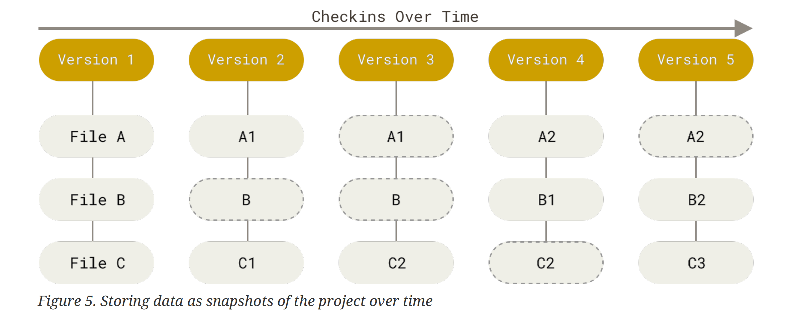
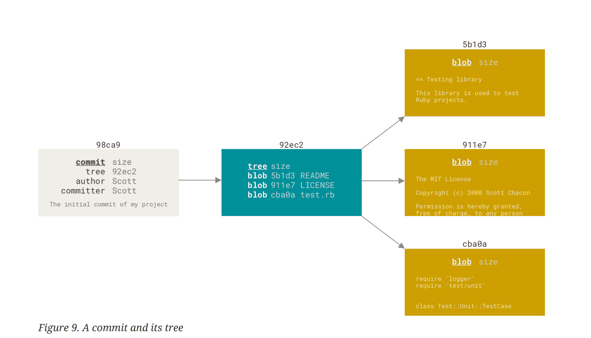

# I - GIT LA GI?

Noi mot cach de hieu, Git la mot he thong quan ly phien ban (Version Control System - VCS). Thay vi luu lai su khac biet giua cac phien ban cua tung tep tin (file), Git chi luu trang cua toan bo du an tai mot thoi diem duoi dang la mot **Snapshot** (Anh chup nhanh).

Moi mot lan **commit**, Git se tao ra mot snapshot moi ghi lai trang thai cua filesystem trong du an tai thoi diem do



Trong hinh minh hoa, moi Version la mot snapshot dai dien cho trang thai cua du an tai mot thoi diem cu the. Cac snapshot nay duoc lien ket voi nhau tao thanh mot chuoi snapshots (stream snapshots) lich su phat trien cua du an theo thoi gian.

Khi co su thay doi trong ma nguon va thuc hien mot commit, Git se tao mot snapshot moi. Doi voi nhung file khong thay dooi trong filesystem, Git khong luu lai ban sao moi ma chi tham hieu den du lieu da ton tai tu snapshot truoc do, giup tiet kiem dung luong luu tru cua thiet bi.

# II - Tinh Toan Ven Cua Git

Khong co bat ky su thay doi nao trong du lieu ma Git khong the phat hien duoc. Moi du lieu duoc Git luu tru deu duoc kiem tra thong qua co che checksum truoc khi ghi vao co so du lieu cua Git.

Git quan ly du lieu dua tren co che ma bam (hash) co ten la SHA-1 (trong cac phien ban moi co the su dung SHA-256). Khi noi dung cua mot hoac nhieu tep tin thay doi va nguoi dung thuc hien commit, Git se tao ra mot snapshot ghi nhan trang thai cua toan bo du an tai thoi diem do. Dong thoi, Git tinh toan mot ma bam duy nhat dua tren noi dung cua commit va cac thong tin lien quan de dinh danh commit do.

Khi mot commit duoc tao ra, noi dung cua commit do la bat bien (cung giong nhu khi lich su duoc tao ra thi lich su khong the thay doi, chi co the tao ra dong chay cua mot lich su moi, lich su hien tai khong the thay doi), vi the khong the thay doi noi dung truc tiep tren commit dang ton tai, chi co the commit de tao ra lich su thay doi trong chuoi hinh thanh lich su phat trien cua mot du an. Nhu vay, lich su cua Git no la mot chuoi cac commits duoc lien ket voi nhau thong qua moi quan he cha - con giua cac commit.

# III - Noi Dung Cua Mot Commit

Khi co su thay doi va commit duoc tao ra tu su thay doi, thi noi dung cua commit do gom co:

```text
tree
parent
author
committer
message
```

Sau khi Commit duoc tao ra, Git se kiem tra toan bo noi dung cua commit do, tao hash SHA-1 dua tren noi dung cua **commit**, dong thoi ma bam nay duoc gan cho cho **commit** do. Dieu nay cung chung minh cho tinh toan ven cua Git nhu da noi o phan tren, khi noi dung cua **commit** thay doi nghia la Hash se khac so voi Hash cua commit goc. Vay nen, neu commit co bat ky su thay doi nao, Git cung deu nhan ra su thay doi do.

>  Noi dung cua mot commit co hinh dang nhu sau:

```
commit 1ef8c44a44886206f2a51bad2ded4554ba39c176 (HEAD -> main, origin/main)
Author: Quangdai2207 <daitran.inbox@gmail.com>
Date:   Sat Jun 20 01:08:39 2026 +0700
```

# IV - Chuoi Lich Su Commit

Nen nho rang, moi mot **commit** la mot doi tuong **(Oject)** gom cac thuoc tinh can thiet cua mot commit. Cac commit xac nhan moi quan he cha con deu dua tren thuoc tinh **parent**.

Nhu da biet, moi mot **commit** deu co Hash rieng biet, va Hash duoc tao ra dua tren toan bo noi dung cua mot **commit**. Khi mot conmit lan dau duoc tao ra, no thuong khong co **parent**. Cac commit ke tiep, ngoai hash dinh danh mac dinh, no con chua ma dinh danh cua cha no **commit**. Dieu nay co nghia, cac commit duoc sinh ra deu biet duoc **parent** cua no la ai.



# V - TONG KET
````text
Git la mot he thong quan ly phien ban ma nguon 
Git ghi lai su thay doi du lieu thong qua commit tai mot thoi diem cua the
Commit tao ra la bat bien, khong the thay doi noi dung cua commit dang ton tai.
Cac Commit co moi quan he cha - con
````
