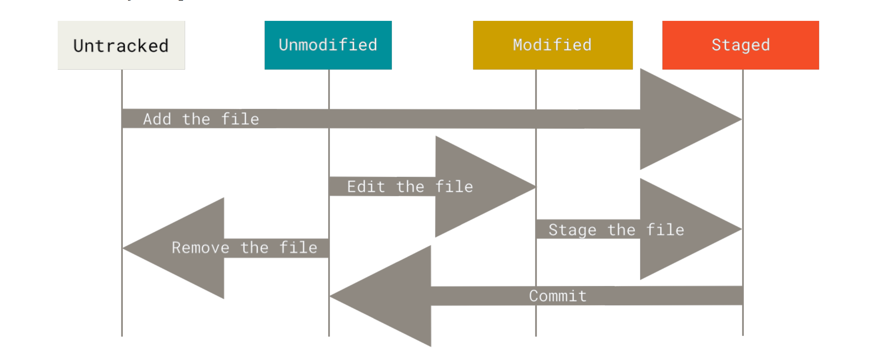

# GIT BASIC - PART 1

Git basic ve co ban giup chung ta co the lam viec voi Git thong qua cac thao tac co ban nhu cau hinh, khoi kho luu tru du lieu, bat dau va dung theo doi mot file, stage va commit thay doi.

1. [Tao kho luu tru cuc bo](#tao-mot-kho-luu-tru-cuc-bo---local-repository)

   - [Su dung `git init` tao kho luu tru](#khoi-tao-repository)
   - [Clone mot kho luu tru co san](#sao-chep-kho-luu-tru-co-san---clone-repository)
2. [Ghi lai cac thay doi vao kho luu tru](#ghi-lai-cac-thay-doi-vao-kho-luu-tru)

   - [Giai thich hinh minh hoa](#giai-thich-hinh-minh-hoa)
     - [Mui ten xuoi](#mui-ten-xuoi)
     - [Mui ten nguoc](#mui-ten-nguoc)
3. [Kiem tra trang thai](#kiem-tra-trang-thai)

## Tao Mot Kho Luu Tru Cuc Bo - Local Repository

De co duoc mot kho luu tru cuc bo (local repository) tre may tinh, co the thuc hien theo 2 cach:

1. Su dung `git init` de tao kho luu tru trong mot folder cu the
2. clone mot kho luu tru co san bang `git clone`

- ### Khoi Tao Kho Luu Tru

  Gia su tren thiet bi, tao mot folder co ten `my-project`, di chuyenn vao ben trong `my-project` sau do dung lenh `git init` de tao mot kho luu tru cuc bo cho `my-project`. Kho luu tru cuc bo co ten la `.git`


  ```bash
  # Tao moi mot folder
  $ mkdir -p my-project

  # CD vao ben trong my-project
  $ cd my-project

  # Dung lenh git init tao kho luu tru
  $ git init

  # Kiem tra co muc .git chua
  $ ls -an

  ```

  Hien tai, thu muc `my-project` hien tai dang trong va chua co bat ky file nao, ta co the them mo so file va them noi dung cho no de thuc hien qua trinh theo doi (tracking) cac file. Dung tai thu muc `my-project`, thuc hien cac lenh sau de them file va noi dung cho file.

  ```bash
  # Them moi 5 file demo
  $ touch demo-{1..5}

  # Them noi dung cho 1 file cu the
  $ echo "Hello" > demo-{1..5}

  # Doi ten cho mot so file
  $ mv demo-1 demo-1.sh && mv demo-2 demo-2.sh

  # Them cac file co .sh vao staging
  $ git add *.sh

  # Chon 1 file cu the muon staged
  $ git add demo-3

  # Chon tat ca files muon staged
  $ git add .

  # Commit dua cac file *.sh vao kho luu tru .git
  $ git commit -m "luu tru cac tep .sh"

  ```
- ### Sao Chep Kho Luu Tru Co San - Clone Repository

  Neu nhu khong muon khoi tao thu cong kho luu tru ngay trong mot du an cuc bo tren may, ta co the dung lenh `git clone` de sao chep mot kho luu tru co san (co the la kho luu tru du an cua cong ty hay mot du an ma ta dang dong gop), thuc hien:


  ```bash
  # Dung tai ~/desktop, thuc hien clonet repo
  $ git clone https://github.com/account/repo-name

  # Kiem tra co thu muc .git khong
  $ ls -an
  ```

  Trong vi du tren, `https://github.com/account/repo-name` la mot kho luu tru co san tren GitHub. Trong do, `account` la ten tai khoan GitHub ma ban dang ky hoac cua chu so huu kho luu tru do, `repo-name` la ten kho luu tru.

  Gia su ta co mot folder la `my-store`, va muon thuc hien clone vao trong `my-store` ta co the thuc hien nhu sau:

  ```bash
  # Dung tai ~/desktop/my-store, thuc hien clonet repo
  $ git clone https://github.com/account/repo-name my-store

  # Kiem tra kho luu tru .git cua repo-name
  $ cd repo-name && ls -na

  ```

# Ghi Lai Cac Thay Doi Vao Kho Luu Tru

Ve co ban, sau khi `git init` hoac `git clone` la ta da co kho luu tru cuc bo ngay tren may (.git). Thoi diem nay thi ta co the thay doi noi dung, them file va thay doi cac trang thai thai cua file, dua file vao cac vung lam viec ma ta muon.

Moi mot file trong vung Working Tree co the co 2 trang thai la `Tracked` va `Untracked`, cu the:

- **Tracked file:**
  La nhung file nam trong commit gan nhat, cung nhat bat ky file nao duoc vao khu vuc luu tam Staging (da duoc staged). Cac file do co the la chua chinh sua hoac da chinh sua so voi version truoc do cua no. Noi de hieu la nhung file ma Git biet den thi duoc xem la `Tracked`.
- **Untracked file:**
  La nhung file chua co commit gan nhat hoac chua duoc dua vao khu vuc staging (chua duoc staged). Khi su dung `git clone` tu mot kho luu tru co san, thi mac dinh toan bo files/folders trong Working Tree da duoc theo doi. Khi lan dau `clone` ve tren thiet bi, cac files/folder nay thuong la chua co bat ky chinh sua hoac thay doi nao, truong hop nay duoc xem la da duoc `tracked` nhung chua chinh sua.

Khi thuc hien thay doi noi dung trong cac files/folder thi Git xem nhu la chung da duoc chinh sua vi noi dung thay doi cua chung khac voi phien ban trong commit gan nhat cua chinh no.

Trong qua trinh lam viec tai Working Tree, ta co the thay doi va chon loc cac thay doi de dua no vao khu vuc luu tam `Staging`, sau do `commit` de xac nhan cac thay doi va luu toan bo thay doi do vao kho du lieu cua Git. Hinh minh hoa vong lap cac trang thai cua file.



- ### Giai thich hinh minh hoa

  Trong hinh co the thay co 2 dong trang thai cua mot tep file trong kho luu tru cua Git. Ta lay dich cuoi cung trong hinh ve nay la `staged` lam diem neo de giai thich vong doi trang thai cua mot file cu the.


  - #### Mui ten xuoi:

    Mui ten xui gom co cac chu thich `Add the file`, `Edit the file` va `Staged the file`


    - **Add the file :** tinh tu diemm bat dau la trang thai `Untracked` den diem cuoi `Staged`, muoi ten xuyen suot di qua lan luot cac trang thai `Unmodified` va `modify` nghia la mot file co the duoc Staged neu file do chua duoc theo doi, chua chinh sua hoac da chinh sua.
    - **Edit the file :** Tinh tu diem `Unmodified` nghia la file do da duoc theo doi nhung chua chinh sua, hay noi cach khac la file da duoc staged nhung khong co thay doi gi so voi noi dung truoc do da duoc staged.
    - **Staged the file :** Tinh tu diem `Modified` nghia la file da duoc theo doi, da co su thay doi o thoi diem hien tai so voi noi dung truoc do cua no da duoc staged va co the dua vao Staging nhung thay doi moi do de danh dau Staged cho noi dung cap nhat moi trong commit tiep theo.
  - #### Mui ten nguoc

    Mui ten nguoc gom co cac chu thich `Commit` va `Remove the file`, day la dong chay thay ro nhat khi `Clone` tu mot kho luu tru da ton tai. Nhu da biet, khi `Clone` thi mac dinh toan bo files/folders trong vung Working Tree la `Last commit` va chua co su thay doi nao va dang o trang thai duoc theo doi `tracked`. Cu the;


    - **Commit :** Tinh tu `Staged` quay nguoc ra `Unmodified` co di qua `Modified`, nghia file do nam trong `last commit` (commit moi nhat) co the co 2 trang thai la `Modified` hoac `Unmodified`.
    - **Remove the file :** Tinh tu `Unmodified` quay ra `Untracked`, nghia la file nay mac du nam trong `last commit` (Commit moi nhat) chua cco su thay doi nao, hoac co su thay doi va co the bo theo doi no `Untracked` file.

    Tu luong thuc thi cua `Mui ten nguoc` co the suy ra duoc file thay doi trang thai trong `Mui ten xuoi`. Nhung gi duoc commit tai mot thoi diem cu the thi duoc xem la `last commit` va trang thai cua cac file se di theo 2 huong mui ten nhu da giai thich.

# Kiem Tra Trang Thai

Kiem tra trang thai la cong cu de biet duoc cac trang thai thay doi cua file, de kiem tra cac trang thai cua file ta co the dung lenh `git status`. khi lan dau `git clone` mot kho luu tru (demo clone **[repo-name]** nhu vi du tren) no se co dang nhu the nay:

```text
$ git status
On branch master
Your branch is up-to-date with 'origin/master'.
nothing to commit, working tree clean
```

Output nay cho ta biet duoc Working Tree hien tai dang sach, chua co bat ky lich su commit nao va nhanh (branch) dang dung hien tai la nhanh `master` tren kho luu tru `.git` local.

Truoc do, ta co demo `git clone` cho `repo-name`, thu tao file moi va them noi dung cho nno roi sau do thuc hien `git status`

```text
$ cd remo-name && echo 'Add content' > README
$ git status
On branch master
Your branch is up-to-date with 'origin/master'.
Untracked files:
  (use "git add <file>..." to include in what will be committed)
  README
nothing added to commit but untracked files present (use "git add" to track)
```

Output cho biet `README` dang trang thai **Untracked**, thuc hien git tracking cho no va sau do thuc hien lai `git status`

```text
$ git add README && git status
On branch master
Your branch is up-to-date with 'origin/master'.
Changes to be committed:
(use "git restore --staged <file>..." to unstage)
  new file: README
```

Output cho biet README duoc theo doi, va README la mot file moi co the dua vao `commit` tiep theo.

Vi du nhu trong `remo-name` co mot file dang ton tai trong Working Tree sau khi `clone` ve co ten `DEMO-100` (tat nhien file nay nam trong `last commited`), thuc hien thay doi noi dung va `git status` cua no ta se thay:

```text
$ echo "Add more content" >> DEMO-100
$ git status
On branch master
Your branch is up-to-date with 'origin/master'.
Changes to be committed:
  (use "git reset HEAD <file>..." to unstage)

  new file: README

Changes not staged for commit:
  (use "git add <file>..." to update what will be committed)
  (use "git checkout -- <file>..." to discard changes in working directory)

  modified: DEMO-100
```

Output cho biet file moi `README` va dnag duoc theo doi nhung chua `commit` va `DEMO-100` da duoc chinh sua nhung chua duoc Staged (Chua dua vao vung staging) cho lan commit tiep theo.

Thuc hien duaa DEMO-100 vao vung nho tam Staging de danh dau Staged

```text
$ git add ./DEMO-100
$ git status
On branch master
Your branch is up-to-date with 'origin/master'.
Changes to be committed:
  (use "git reset HEAD <file>..." to unstage)

  new file: README
  modified: DEMO-100.md

```

Ouyput cho biet mot cai la file moi README da duoc theo doi va mot file da danh dau la da chinh sua san sang dua vao `commit` tiep theo.

Ca 2 file README va DEMO-100 hien tai da Staged va co the san sang de `commit`. Tuy nhien, truoc khi commit ta co the chinh sua lai noi dung cho DEMO-100 va sao do thuc hien `git status` de kiem tra trang thai

```text
# Them noi dung cho DEMO-100
$ echo "aaaa" >> DEMO-100

$ git status
On branch master
Your branch is up-to-date with 'origin/master'.
Changes to be committed:
  (use "git reset HEAD <file>..." to unstage)

  new file: README
  modified: DEMO-100.md

Changes not staged for commit:
  (use "git add <file>..." to update what will be committed)
  (use "git checkout -- <file>..." to discard changes in working directory)

  modified: DEMO-100.md

```

Lan nay ta thay DEMO-100 vua xuat hien o khu vuc Staged vua xuat hien khu vuc chua Staged trong **Output**. De giai thich cho viec nay tai thoi diem chinh sua DEMO-100 lan dau tien, ta da danh dau la Staged nhung chua `commit`, chi moi la dua no vao vung Staging cho lan `commit` tiep theo. Khi lan thu 2 chinh sua DEMO-100, luc nay Git se so sanh lan thay doi cuoi cung o thoi diem hien tai so voi noi dung cua lan thay doi gan nhat da duoc Staged.

Tai lan thu 2 ta them `aaaa` cho DEMO-100, git se so sanh `aaaa` nay so voi lan dau tien khi them noi dung da duoc Staged la `Add more content`
thi luc nay lan thay doi cuoi cung nay khac so voi lan thay doi gan nhat da duoc Staged. Su dung `git diff` de kiem tra

```text
$ git diff DEMO-100
    diff --git a/DEMO-100 b/DEMO-100
    index db50baa..db101b1 100644
    --- a/DEMO-100
    +++ b/DEMO-100
    @@ -1,1 +1,2 @@
    Add more content
    + aaaa

```

Output cho biet compare **b/DEMO-100** da them `+aaaa` so voi **a/DEMO-100**. Thuc hien `git add` them thay doi cua DEMO-100 vao Staged cho `commit` tiep theo

```text
$ git add ./DEMO-100
$ git status
On branch master
Your branch is up-to-date with 'origin/master'.
Changes to be committed:
  (use "git reset HEAD <file>..." to unstage)

  new file: README
  modified: DEMO-100.md

```

# Kiem Tra Trang Thai Dang Short

Ngoai viec kiem tra trang thai day du, Git con ho tro mot trang thaai dang ngan gon hon bang cach them flag `-s` hoac `--short`

```text
$ git status -s
     M  README                          [ M] README
    MM  Rakefile                        [MM] Rakefile
    A   lib/git.rb                      [A ] lib/git.rb
    M   lib/simplegit.rb                [M ] lib/simplegit.rb
    ??  LICENSE.txt                     [??] LICENSE.txt

```

Output cho thay tai moi file co ky hieu ky tu don va ky tu kep. Mac dinh, khi dung `-s` thi dau ra se la 2 ky tu, ky tu nao dung mot minh thi ngam hieu rang sau hoac truoc no la mot ky rong `' ' => [A'']`.
Ky tu dau tien la trang thai cua file, va ky tu dung sau no la bieu thi cho trang thai cua Working Tree hay noi cach khac ly tu dau tien bieu thi cho trang thai so voi `last commit` va ky tu dung sau trang thai index Staged.

```text
[ M] README, nghia la file nay da duoc chinh sua nhung chua staged
[MM] Rakefile, nghia la file nay da chinh sua, da duoc staged roi sau do chinh sua lai
[A ] file nay da duoc staged vao vung Staging
[M ] Da duoc chinh sua va da duoc Staged vung Staging
[??] file chua duoc Tracked.
```

[⬆️ Ve dau trang](#git-basic)
🚀 Xem tiep [Git basic - part 2](./git-basic-2.md)
