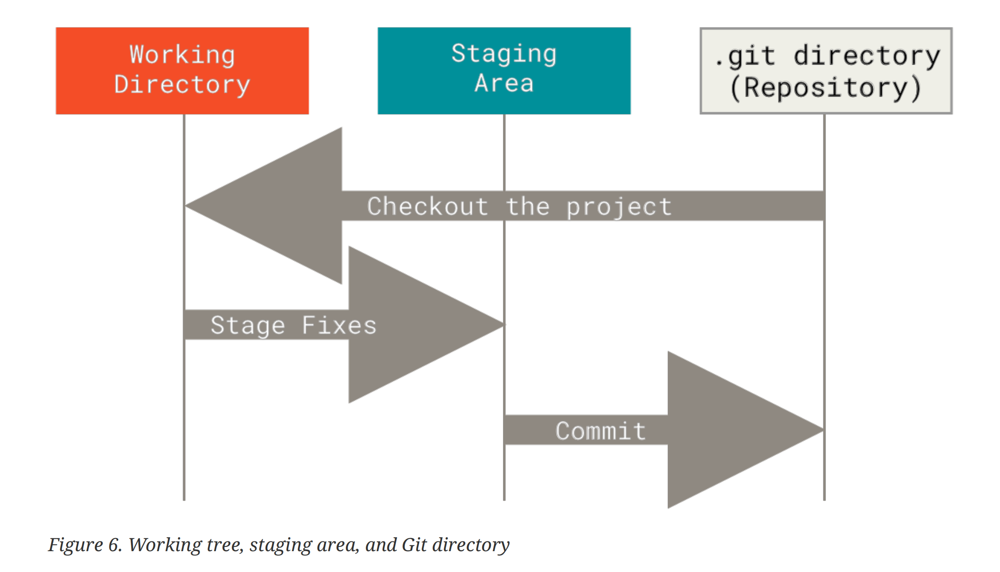

# 3 TRANG THAI

Khi lam viec voi Git can phai nho rang cac tep tin co the co 3 trang thai khai nhau tai moi thoi diem, cac tep co the la Modified, Staged va Commited.

- **Modified:** Nghia la tep da duoc chinh sua nhung chua commit no vao co so du lieu
- **Staged:** Tep da duoc danh dau la sua chua so voi version hien tai cua no va da duoc dua vao vung cho de dua no vao commit tiep theo
- **Commited:** Xac nhan thay doi va du lieu duoc vao co so du lieu cuc bo

3 trang thai nay dan den 3 phan chinh cua Git Project la: Working Directory, Staging Area, Repository/ .git directory (Local), hinh minh hoa;



- **Working Tree:**
  Working tree hay con con goi la Working Directory, day la khu vuc hien tai chua cac files hoac folders ma ta co the nhin thay duoc, tuong tac duoc va lam viec duoc voi chung. Wroking Tree la phan du lieu duoc Git giai nen tu trong co so du lieu cua `.git` dat len o dia tai thu muc lam viec hien tai de ta co the chinh sua va lam viec.
- **Staging Area:**
  KHi tren vung lam viec Working Tree co su thay doi noi dung trong files hoac folder, git can biet nhung thay doi nao de dua vao commit tiep theo. Staging Area la noi chua cac thay doi do de dua chung vao commit tiep theo.
- **Repository (.git local)**
  Day la khu vuc chua sieu du lieu va toan bo cac thay doi da duoc commit tu khu vuc Staging Area.

Luong thuc thi co ban cua no nhu sau:

````text
1. Thay doi mot so noi dung trog khu vuc Working Tree.
2. Chon cac thay doi do va dua vao khu vuc luu tam Staging Area.
3. Thuc hien commit de dua cac thay doi trong khu vuc luu tam Staging Area vao repository .git luu vinh vien.

Neu mot version cu the cua mot file nam trong repository .git local thi duoc coi la da commited. 
Neu mot phien ban cua mot file da duoc chinh sua so voi phien ban truoc do cua no va duoc dua vao khu vuc luu tam Staging thi no co trang thai la Staging. 
Neu mot file da duoc chinh sua so coi phien ban truoc do cua no ma chua dua vao vung luu tam Staging Area thi no duoc xem la Modified.
````

# TONG KET

- Git co 3 trang thai can phai nho: **Modified, Staged, Commit**
- Moi mot trang thai se ung voi khu vuc ma no dang dung: **Working Tree, Staging Area, Repository .git (Local)**

|   | **Trang Thai**       | **Khu vuc**        |
| - | -------------------- | -------------------|
| 1 | Modified             | Working Tree       |   
| 2 | Staged               | Staging Area       |
| 3 | Commited             | Repository         |

- [Cai dat GIT](./git-install.md)
